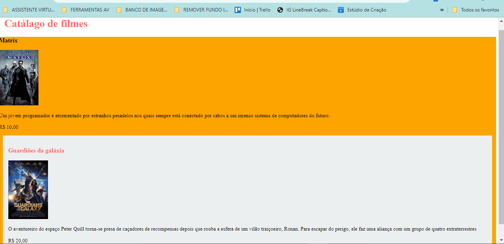

# PROJETO Catálago de filmes - nomes são importantes
Um projeto de site com Catálogo dos nomes dos filmes para alugar contendo o nome do filme, a foto de promoção do filme, uma breve descrição do filme e o valor do aluguel do filme para telas de computadores e de celulares📲💻

 (http://127.0.0.1:5502/index.html)

## Tecnologias utilizadas
- HTML
- CSS

## 📂Acesso ao projeto

**Você pode acessar o código fonte do projeto 

<https://github.com/denisero19/nomes-sao-importantes>**